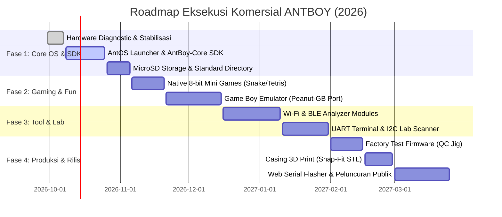

# PRODUCT REQUIREMENT DOCUMENT (PRD)
## ANTBOY (2026) — Multi-Purpose Cyber-Gaming Handheld Device

---

| Dokumen | Nilai |
|---|---|
| **Nama Proyek** | **ANTBOY (2026) Multi-Purpose Handheld Ecosystem** |
| **Versi Dokumen** | **1.2 (Commercial & Production Gold Master Specification)** |
| **Tanggal Pembaruan** | September 2026 |
| **Status** | Active / Bring-Up Complete / Firmware & Commercialization Phase |
| **Lead Developer & Hardware Designer** | Anton Prafanto |
| **Target Rilis MVP** | Q4 2026 |
| **Lisensi Hardware** | Proprietary (Distribusi hanya berkas Gerber produksi, source CAD/KiCad dilindungi) |
| **Lisensi Software** | Open-Core / MIT (Kernel AntOS, SDK Pengembang & Aplikasi Komunitas) |
| **Repository Resmi** | `https://github.com/antonprafanto/antboy.git` |

---

## 1. Executive Summary & Visi Produk

### 1.1 Latar Belakang & Masalah Pasar
Pasar konsol genggam retro DIY saat ini terpecah menjadi dua kategori ekstrem:
1. **Konsol Game Murni**: Hanya berfungsi untuk bermain game retro (misal: Arduboy, Odroid-Go), tanpa kemampuan konektivitas nirkabel atau kegunaan di dunia kerja nyata.
2. **Gadget Hacker/Hacker Tool**: Berfungsi untuk network/hardware security (misal: Flipper Zero, M5Stack Cardputer), namun tidak memiliki ergonomi controller game yang nyaman untuk hiburan harian.

### 1.2 Visi & Nilai Unik ANTBOY
**ANTBOY (2026)** menjembatani kedua dunia tersebut menjadi sebuah perangkat **EDC (Everyday Carry)** saku multifungsi:
> *"Bermain game retro klasik di saat santai, lalu beralih menjadi alat audit jaringan nirkabel, kontroler smart home, dan asisten lab elektronika saat bekerja."*

Perangkat ini dirancang dengan PCB 2-layer kustom (dimensi kompak 68.5 x 84.0 mm), ditenagai modul **ESP32 Dual-Core (Wi-Fi + BLE)**, layar tajam **2.0" IPS 320x240**, tata letak tombol ergonomis Game Boy (D-Pad analog ladder + A/B + 4 tombol fungsi), slot MicroSD, dan **Expansion Header GPIO 15-Pin** di sisi samping untuk modul modular (*backpack/cartridge*).

---

## 2. Target Pengguna & Persona

1. **Maker & Hardware Hacker**: Membutuhkan alat saku untuk membaca sinyal serial (UART), memindai sensor I2C, dan bereksperimen dengan protokol radio nirkabel tanpa harus membawa laptop.
2. **Mahasiswa / Pelajar Teknik Elektro & IT**: Menginginkan platform belajar mikrokontroler, FreeRTOS, dan pengembangan game embedded yang terjangkau, modular, dan menyenangkan.
3. **Retro Gaming Enthusiast**: Penggemar konsol portabel yang ingin memainkan game 8-bit klasik dan game homebrew buatan komunitas.
4. **Sysadmin & IoT Engineer**: Profesional yang memerlukan alat praktis untuk mengecek kanal Wi-Fi, menguji sinyal BLE, atau mengontrol perangkat MQTT smart home di lapangan.

---

## 3. Spesifikasi Hardware (Hardware Baseline V1)

### 3.1 Blok Diagram Arsitektur Hardware

```text
                 +---------------------------------------------------+
                 |           ANTBOY (2026) Hardware Core             |
                 +---------------------------------------------------+
                                           |
         +---------------------------------+---------------------------------+
         |                                 |                                 |
 [ Input Subsystem ]             [ Compute Subsystem ]             [ Output Subsystem ]
 - D-Pad (IO34, IO35)            - ESP32-WROOM-32 (240MHz)         - ST7789 IPS 320x240 (SPI)
 - Action: A (IO33), B (IO32)    - 520 KB SRAM / 4MB Flash         - Piezo Buzzer (IO26)
 - Func: SEL(27), STA(39)        - Wi-Fi 802.11 b/g/n              - Status LED Hijau (IO2)
 - Func: MEN(13), VOL(0)         - Bluetooth 4.2 BR/EDR+BLE        - MicroSD FAT32 (SPI, IO22)
 - Side Expansion 15-Pin (J4)    - Power Switch SPDT (SW0)         - Backlight PWM (IO14)
```

### 3.2 Tabel Pemetaan Pinout Komprehensif (Hardware V1)

| Periferal | Label Net | Pin ESP32 | Tipe I/O | Keterangan Rangkaian & Polarisasi |
|---|---|---|---|---|
| **Layar - SCK** | `/IO18` | GPIO 18 | Output | VSPI Bus Clock (Shared dengan MicroSD & J4 Pin 6) |
| **Layar - MOSI (SDA)**| `IO23` | GPIO 23 | Output | VSPI Bus Data (Shared dengan MicroSD & J4 Pin 10) |
| **Layar - CS** | `IO5` | GPIO 5 | Output | Active-LOW Chip Select ST7789 (Shared dengan J4 Pin 2) |
| **Layar - DC** | `IO21` | GPIO 21 | Output | Data/Command selector (Shared dengan J4 Pin 8) |
| **Layar - BLK** | `IO14` | GPIO 14 | Output | Backlight Control (HIGH = ON, PWM capable, Shared J4 Pin 4) |
| **Layar - RST** | `RST` | EN / CHIP_PU | Reset | **Hardwired ke Reset ESP32** (Bukan GPIO terpisah) |
| **MicroSD - CS** | `IO22` | GPIO 22 | Output | Active-LOW Chip Select SD Card (Shared J4 Pin 9) |
| **MicroSD - MISO** | `IO19` | GPIO 19 | Input | VSPI Data In / DAT0 (Shared J4 Pin 7) |
| **MicroSD - MOSI** | `IO23` | GPIO 23 | Output | VSPI Data Out / CMD (Shared ST7789) |
| **MicroSD - SCK** | `/IO18` | GPIO 18 | Output | VSPI Clock (Shared ST7789) |
| **MicroSD - DET** | `NC` | - | - | Card Detect pin tidak terhubung ke MCU (Polling mode) |
| **D-Pad Vertikal** | `IO35` | GPIO 35 (ADC1_CH7) | Input | UP = 4095 (3.3V), DOWN = ~2048 (Divider via R4 10k & R6 10k) |
| **D-Pad Horizontal**| `IO34` | GPIO 34 (ADC1_CH6) | Input | LEFT = 4095 (3.3V), RIGHT = ~2048 (Divider via R5 10k & R7 10k) |
| **Tombol A** | `IO33` | GPIO 33 | Input | Active-LOW ke GND, internal pull-up (Shared J4 Pin 15) |
| **Tombol B** | `IO32` | GPIO 32 | Input | Active-LOW ke GND, internal pull-up (Shared J4 Pin 14) |
| **Tombol SELECT** | `IO27` | GPIO 27 | Input | Active-LOW ke GND, internal pull-up (Shared J4 Pin 13) |
| **Tombol START** | `VN` / `IO39` | GPIO 39 (Sensor_VN) | Input | Active-LOW ke GND, pull-up eksternal R9 10k ke 3.3V |
| **Tombol MENU** | `IO13` | GPIO 13 | Input | Active-LOW ke GND, internal pull-up (Shared J4 Pin 3) |
| **Tombol VOL** | `IO0` | GPIO 0 | Input | Active-LOW ke GND, pull-up eksternal R3 10k ke 3.3V |
| **Audio Buzzer** | `IO26` | GPIO 26 | Output | Passive Piezo via R1 (1kΩ seri) ke J3. Resonansi 1.7–3.1 kHz |
| **Status LED** | `IO2` | GPIO 2 | Output | LED Hijau D1 via R10 (10kΩ seri) ke GND. HIGH = ON |
| **Power Switch** | `SW0` | - | Sakelar | SPDT Slide Switch pemutus jalur 3.3V antara regulator dan modul |

---

## 4. Analisis Ekspansi GPIO & Matriks Konflik Bus (J4 Header)

Header samping 15-pin (J4) dirancang untuk kartu ekspansi modular. Pengembang add-on **wajib** memahami matriks ketersediaan pin berikut:

```text
                       HEADER EKSPANSI 15-PIN (J4)
+------+--------+---------------------+------------------------------------------+
| Pin  | Net    | Status Internal     | Rekomendasi Penggunaan Add-on            |
+------+--------+---------------------+------------------------------------------+
| 1    | IO4    | BEBAS (Isolasi)     | GPIO Bebas / I2C SDA / Touch 0 / ADC2    |
| 2    | IO5    | SHARED: ST7789 CS   | JANGAN DIGUNAKAN saat LCD aktif          |
| 3    | IO13   | SHARED: Tombol MENU | Input Interrupt / Active-LOW Button      |
| 4    | IO14   | SHARED: Backlight   | JANGAN DIGUNAKAN (Khusus kontrol layar)  |
| 5    | IO16   | BEBAS (Isolasi)     | UART2 RX2 / I2C SCL / 1-Wire / NeoPixel  |
| 6    | IO18   | SHARED: SPI SCK     | SPI Bus Clock untuk Add-on Shield        |
| 7    | IO19   | SHARED: SD MISO     | SPI Bus MISO untuk Add-on Shield         |
| 8    | IO21   | SHARED: ST7789 DC   | JANGAN DIGUNAKAN saat render grafis      |
| 9    | IO22   | SHARED: SD Card CS  | JANGAN DIGUNAKAN untuk I2C (Gunakan CS)  |
| 10   | IO23   | SHARED: SPI MOSI    | SPI Bus MOSI untuk Add-on Shield         |
| 11   | IO25   | BEBAS (Isolasi)     | DAC Channel 1 / Analog Out / Servo PWM   |
| 12   | IO26   | SHARED: Buzzer J3   | Output Audio / PFM Tone                  |
| 13   | IO27   | SHARED: Tombol SEL  | Input Interrupt Eksternal                |
| 14   | IO32   | SHARED: Tombol B    | Input Button Eksternal                   |
| 15   | IO33   | SHARED: Tombol A    | Input Button Eksternal                   |
+------+--------+---------------------+------------------------------------------+
```

> [!IMPORTANT]
> **Pedoman Alokasi Pin Bebas (Zero Conflict)**:
> Modul Add-on baru sebaiknya memprioritaskan 3 pin yang 100% bebas:
> - **`IO4`** (Bebas)
> - **`IO16`** (Bebas)
> - **`IO25`** (Bebas, mendukung True 8-bit DAC)
> - Untuk bus **I2C Add-on**, gunakan konfigurasi: **SDA = `IO4`** dan **SCL = `IO16`** (JANGAN gunakan IO22 karena merupakan CS MicroSD).

---

## 5. Hardware Errata & Catatan Revisi (HW V1 vs HW V1.1)

### [HW-ERR-01] Resistor Seri Buzzer 1kΩ (Low Acoustic Volume)
- **Kondisi**: Resistor R1 terpasang 1kΩ antara GPIO 26 dan Buzzer J3 (impedansi ~16–32Ω). Mengakibatkan drop tegangan 97% di resistor, sehingga buzzer bersuara lirih.
- **Solusi Firmware V1**: Gunakan modulasi frekuensi pada titik resonansi akustik fisik buzzer (1,700 Hz s.d. 3,100 Hz) untuk efisiensi transfer energi maksimum.
- **Rencana Revisi HW V1.1**: Ganti R1 dengan nilai 33Ω–100Ω, atau tambahkan transistor NPN buffer (S8050 / 2N2222) dengan dioda flyback untuk volume maksimal.

### [HW-ERR-02] Ketiadaan Divider Tegangan ADC Pemantau Baterai
- **Kondisi**: Carrier PCB V1 tidak memiliki sirkuit pembagi tegangan (voltage divider) dari jalur baterai/5V ke pin ADC ESP32.
- **Solusi Firmware V1**: Tampilan persentase baterai di UI disimulasikan atau dinonaktifkan sementara saat berjalan pada board V1 tanpa modul tambahan.
- **Rencana Revisi HW V1.1**: Menambahkan sirkuit resistor divider 100kΩ / 100kΩ dari V_BAT ke pin `IO36` (VP/A0) yang saat ini tidak terpakai (Pad 4 U1 unconnected).

### [HW-ERR-03] Ketiadaan Pin Power (3.3V/5V dan GND) pada Header J4
- **Kondisi**: Header samping 15-pin (J4) seluruhnya mengalirkan sinyal GPIO, tanpa ada pin pinout daya (+3.3V/GND) khusus pada baris 15-pin tersebut.
- **Solusi DIY V1**: Modul shield mengambil kabel jumper daya (+3.3V dan GND) langsung dari pin socket modul Wemos D1 Mini32.
- **Rencana Revisi HW V1.1**: Mengubah form-factor header ekspansi menjadi 2x8 pin (16-pin) atau 1x16 pin yang menyertakan pin VCC 3.3V, 5V, dan GND.

---

## 6. Spesifikasi Mekanikal, Casing & Rekomendasi Baterai

```text
                    TATA LETAK FISIK & MOUNTING HOLES ANTBOY V1
       |<----------------------- 68.50 mm ----------------------->|
   --- +----------------------------------------------------------+
    ^  | (O) [Hole 1: M3]    [SW0: Power]        (O) [Hole 2: M3] |
    |  | +------------------------------------------------------+ |
    |  | |                                                      | |
    |  | |           ST7789 2.0" IPS LCD (320x240)              | |
    |  | |                Mode Landscape Asli                   | |
 84.00 | |                                                      | |
   mm  | +------------------------------------------------------+ |
    |  |  [START]       [SELECT]         [VOL]         [MENU]     |
    |  |                                                          |
    |  |    [UP]                         (O) [Hole 3: M3]         |
    |  | [LEFT] [RIGHT]     [R-Ladder]            [A]             |
    |  |    [DOWN]          [Array SMD]               [B]         |
    |  |                                                          |
    v  | (O) [Hole 4: M3]  ANTBOY (2026)         (O) [Hole 5: M3] |
   --- +----------------------------------------------------------+
       * Catatan Mekanikal: 5x Lubang Baut M3 (Drill 3.0 mm, Pad 4.0 mm)
```

### 6.1 Dimensi PCB, Komponen Sisi Depan & Casing M3
1. **Dimensi Presisi PCB**: Tepat **68.50 mm (Lebar) x 84.00 mm (Tinggi)** dengan ketebalan FR-4 standar 1.6 mm.
2. **5x Lubang Baut Standar M3 (Mounting Holes Onboard)**:
   - PCB telah dilengkapi **5 lubang baut M3 (Drill 3.0 mm, Annular Pad 4.0 mm)**:
     - **Hole 1 (Kiri Atas)**: Koordinat X: 94.0, Y: 63.0
     - **Hole 2 (Kanan Atas / Display)**: Koordinat X: 127.0, Y: 90.0
     - **Hole 3 (Tengah Kanan / dekat Tombol A)**: Koordinat X: 136.5, Y: 115.5
     - **Hole 4 (Sudut Kiri Bawah)**: Koordinat X: 94.5, Y: 137.5
     - **Hole 5 (Sudut Kanan Bawah)**: Koordinat X: 152.0, Y: 137.5
   - **Rekomendasi Casing 3D Print / Akrilik**:
     - Casing dapat menggunakan **Baut M3 × 6mm / 8mm** dan standoff kuningan M3 (lebih kokoh dan awet dibanding murni snap-fit).
     - Desain casing *sandwich* (pelat depan + pelat belakang) diikat langsung menggunakan 5 baut M3 tersebut.
3. **Komponen SMD Sisi Depan (Front-Side Clearance)**:
   - Di sisi depan PCB, terdapat deretan komponen SMD:
     - Kolom 4x resistor ladder 1206 di tengah (R4, R5, R6, R7 untuk D-Pad).
     - Resistor 1206 di antara tombol START-SELECT dan VOL-MENU.
     - LED indikator status D1 di tengah.
   - **Toleransi Faceplate Casing**: Faceplate depan wajib memiliki ceruk (*cavity clearance*) minimal **1.0 mm** di area tengah agar tidak menekan komponen SMD tersebut saat baut M3 dikencangkan.
4. **Tata Letak Tombol Nyata (Sesuai Silkscreen Board)**:
   - **Baris Fungsi (Tepat di bawah layar)**: `[START]` - `[SELECT]` - `[VOL]` - `[MENU]`.
   - **Kluster D-Pad (Sisi Kiri)**: `[UP]`, `[DOWN]`, `[LEFT]`, `[RIGHT]`.
   - **Kluster Action (Sisi Kanan)**: `[A]` (posisi atas) dan `[B]` (posisi bawah).
   - **Branding Silkscreen Depan**: `ANTBOY (2026) Multi-Purpose Device` di tengah bawah, dan vertikal `s.id/antonprafanto` di bibir kanan.

### 6.2 Rekomendasi Pemilihan Baterai Li-Po (Form Factor)
Untuk memastikan baterai muat secara ergonomis di dalam casing belakang ANTBOY tanpa membuat perangkat terlalu tebal:
1. **Baterai Model 503040**:
   - Dimensi: Tebal 5.0 mm × Lebar 30 mm × Panjang 40 mm.
   - Kapasitas: **~600 mAh**.
   - Estimasi Runtime: **3.5 – 4.5 jam** pemakaian aktif (Gaming/Tools).
2. **Baterai Model 603048 (Rekomendasi Utama)**:
   - Dimensi: Tebal 6.0 mm × Lebar 30 mm × Panjang 48 mm.
   - Kapasitas: **~900 mAh**.
   - Estimasi Runtime: **5.5 – 7.0 jam** pemakaian aktif.
3. **Standar Keamanan Baterai**: Wajib menggunakan baterai Li-Po 3.7V dengan **PCM Protection Board Onboard** (proteksi Over-charge 4.25V, Over-discharge 2.75V, dan Short-circuit protection).

---

## 7. Arsitektur Software: "AntOS"

Sistem operasi modular berbasis **FreeRTOS** dengan arsitektur dua inti (*Dual-Core Task Separation*).

```text
+-------------------------------------------------------------------+
|                           AntOS LAUNCHER                          |
|             (Carousel Menu, Quick Settings, Status Bar)           |
+-------------------+-------------------+-------------------+-------+
|  PILAR 1: GAMING  | PILAR 2: WIRELESS |  PILAR 3: IoT     | PILAR 4: LAB   |
| - Game Boy Emu    | - Wi-Fi Analyzer  | - ESP-NOW Chat    | - UART Monitor |
| - Native Games    | - BLE Scanner     | - MQTT Dashboard  | - I2C Scanner  |
| - Chiptune Audio  | - BLE Gamepad HID | - Clock & Weather | - Signal Gen   |
+-------------------+-------------------+-------------------+----------------+
|                        AntOS CORE SERVICES                         |
|  Power Manager | File System (FAT32) | Audio Engine | Display HAL & DMA    |
+--------------------------------------------------------------------+
|                         FreeRTOS KERNEL                            |
|        Core 0: Network & Background   |   Core 1: UI Engine & Input        |
+--------------------------------------------------------------------+
```

### 7.1 Protokol Arbitrasi SPI Bus (ST7789 vs MicroSD)
Karena layar LCD dan kartu MicroSD berbagi jalur clock (`IO18`) dan data MOSI (`IO23`), kernel AntOS memberlakukan aturan arbitrasi:
1. **Mutex Mutlak**: Setiap akses file IO di MicroSD wajib mengunci `spi_bus_mutex`.
2. **Chip Select Isolation**:
   - Saat MicroSD aktif (`IO22` LOW), pin LCD CS (`IO5`) dipaksa HIGH.
   - Saat Layar me-render frame buffer via DMA, pin SD CS (`IO22`) dipaksa HIGH.
3. **Kecepatan Bus**:
   - Mode Rendering Layar: 40 MHz SPI (Mode 3).
   - Mode Akses MicroSD: 20–25 MHz SPI (Mode 0). Frekuensi disesuaikan otomatis sebelum transaksi dimulai.

### 7.2 Kontrol Volume Suara & Kecerahan Layar (Software PWM)
1. **Sistem Kontrol Volume (`VOL` Button / `IO0`)**:
   - Tekan tombol `VOL` untuk siklus level: `MUTE (0%)` -> `LOW (25%)` -> `MED (50%)` -> `HIGH (75%)` -> `MAX (100%)`.
   - Modulasi volume piezo dicapai melalui pengaturan PWM Duty Cycle (0% s.d. 50%) atau pembatasan burst pulsa frekuensi.
   - Tampilan visual OSD (On-Screen Display) muncul selama 1.5 detik di layar setiap kali level volume diubah.
2. **Kontrol Kecerahan Layar (`IO14` / BLK)**:
   - Digerakkan oleh timer PWM hardware ESP32 LEDC pada frekuensi **5 kHz** (menghindari kedipan kasat mata dan desisan frekuensi audio).
   - 5 level kecerahan: 20%, 40%, 60%, 80%, 100%. Auto-dimming aktif setelah 30 detik tanpa input tombol.

---

## 8. Standarisasi File System MicroSD (FAT32 Directory Tree)

Untuk memastikan kompatibilitas ROM game, file log, dan aplikasi pihak ketiga, susunan folder pada kartu MicroSD distandarisasi sebagai berikut:

```text
SDCARD:/ (FAT32, Cluster 32KB)
├── antos/
│   ├── settings.json          # Konfigurasi sistem (Wi-Fi, Volume, Kecerahan, Tema)
│   ├── theme/                 # Palet warna retro & ikon kustom
│   └── boot.log               # Catatan diagnostik sistem
├── roms/
│   ├── gb/                    # Berkas ROM Game Boy (.gb / .gbc)
│   └── saves/                 # Berkas save-state emulator (.sav)
├── apps/                      # Modul aplikasi executable komunitas (.bin)
├── music/                     # Koleksi lagu chiptune 8-bit (.mid, .vgm, .rtttl)
├── logs/
│   ├── wifi_survey.csv        # Ekspor data analisis sinyal Wi-Fi
│   ├── ble_devices.csv        # Log perangkat Bluetooth sekitar
│   └── uart_capture.txt       # Rekaman sesi Serial Monitor lab
└── screenshots/               # Tangkapan layar konsol (format .bmp 320x240)
```

---

## 9. SDK Pengembang & Ekosistem Komunitas (`AntBoy-Core.h`)

Untuk memungkinkan pengembang pihak ketiga membuat game atau tool mandiri tanpa harus mempelajari register perangkat keras, disediakan pustaka resmi **`AntBoy-Core`**:

```cpp
#include <AntBoy.h>

void setup() {
    AntBoy.begin(); // Menginisialisasi Layar 320x240, SPI, Tombol, ADC, & SD
    AntBoy.Display.fillScreen(COLOR_BLACK);
    AntBoy.Audio.playTone(2093, 100); // Nada konfirmasi boot
}

void loop() {
    AntBoy.update(); // Polling tombol dan D-Pad (latensi < 5ms)

    if (AntBoy.Buttons.wasPressed(BTN_A)) {
        AntBoy.Audio.playTone(2637, 50); // Feedback klik tombol
    }

    Direction dir = AntBoy.Buttons.readDpad();
    if (dir == DIR_RIGHT) {
        // Gerakkan karakter ke kanan
    }

    AntBoy.Display.render();
}
```

### API Abstraction Layer:
- **`AntBoy.Buttons`**: `isPressed(btn)`, `wasPressed(btn)`, `readDpad()`, `getADC_V()`.
- **`AntBoy.Display`**: `drawPixel()`, `drawSprite()`, `printText()`, `pushFrameDMA()`.
- **`AntBoy.Audio`**: `playTone(freq, dur)`, `playRTTTL(tune)`, `setVolume(lvl)`.
- **`AntBoy.SD`**: `exists(path)`, `readString(path)`, `writeLog(path, data)`.
- **`AntBoy.Header`**: Akses aman ke pin bebas `IO4`, `IO16`, dan `IO25`.

---

## 10. Pipeline Distribusi Firmware: Web Flasher & OTA Update

Untuk memudahkan pengguna awam (non-programmer) memasang game baru atau memperbarui AntOS tanpa perlu menginstal PlatformIO / VS Code:

1. **Zero-Install Web Serial Flasher (ESP Web Tools)**:
   - Pengguna cukup membuka peramban Google Chrome / Microsoft Edge di komputer.
   - Sambungkan ANTBOY via kabel USB ke port Wemos D1 Mini.
   - Buka situs web resmi `antboy.dev/flash` dan klik tombol **"Install AntOS"**. Web Serial API langsung mem-flash firmware, bootloader, dan partisi SPIFFS secara otomatis dalam 60 detik.
2. **OTA (Over-The-Air) Wi-Fi Update**:
   - Di dalam menu Pengaturan AntOS, pilih opsi **"Check System Update"**.
   - ANTBOY akan tersambung ke Wi-Fi rumah, memeriksa *GitHub Releases API* resmi, mengunduh file `.bin` terbaru, dan me-reboot sistem secara mandiri.

---

## 11. Prosedur Quality Control (QC) & Factory Test Suite

Sebelum papan PCB atau kit Tier 2 & Tier 3 dikirimkan ke pembeli, setiap unit wajib lolos uji firmware diagnostik pabrik (`factory_test.bin`):

```text
                   ALUR DIAGNOSTIK FACTORY TEST
[Start Test] -> [Display 5-Color Screen] -> [10-Button Matrix Press]
                     |                               |
          (No Dead Pixels?)                 (All Keys Turn Green)
                     |                               |
[Pass/Fail]  <- [Wi-Fi/BLE RSSI Pass]   <- [MicroSD R/W 512KB Test]
```

1. **Uji Layar (Dead Pixel Check)**: Layar menyala bergantian warna Merah, Hijau, Biru, Putih, dan Hitam untuk memastikan panel IPS bebas *dead pixel* dan *backlight bleed*.
2. **Uji Matriks Tombol & Kalibrasi ADC**: Menampilkan gambar konsol di layar. Setiap kali tombol A, B, SEL, STA, MEN, VOL, dan 4 arah D-Pad ditekan, ikon tombol di layar berubah hijau. Nilai toleransi ADC D-Pad `IO34` dan `IO35` ditampilkan secara numerik.
3. **Uji Baca-Tulis MicroSD**: Menulis berkas uji 512 KB, memverifikasi checksum, dan memastikan kecepatan baca ≥ 1.5 MB/s.
4. **Uji Akustik Buzzer**: Memainkan tangga nada dari 1.7 kHz s.d. 3.1 kHz untuk memastikan solderan buzzer terpasang sempurna.
5. **Uji Sinyal Nirkabel**: Memindai minimal 1 sinyal SSID Wi-Fi dan 1 sinyal suar BLE untuk memastikan antena chip ESP32 bekerja prima.

---

## 12. Aspek Legalitas, Etika & Regulasi Nirkabel (Pilar 2)

Perangkat ini dirancang sebagai platform edukasi, riset, dan audit diagnostik jaringan:
1. **Mode Pasif (Passive Monitoring Only)**: Seluruh fitur penganalisis Wi-Fi dan BLE pada firmware bawaan pabrik beroperasi dalam mode *promiscuous listener* non-intrusif. ANTBOY tidak memancarkan paket penyerangan (*deauthentication / denial of service*).
2. **Kepatuhan Regulasi Frekuensi**: Penerimaan sinyal hanya terbatas pada pita frekuensi bebas izin (*unlicensed ISM Band 2.400 GHz – 2.4835 GHz*) sesuai ketetapan Kominfo dan FCC Part 15.
3. **Pernyataan Penafian (Disclaimer)**: Setiap pengguna bertanggung jawab penuh atas penggunaan perangkat sesuai hukum dan etika siber yang berlaku.

---

## 13. Strategi Komersialisasi & Perlindungan Anti-Kloning

### 13.1 Model Lisensi & Dual-Tier Software
- **Open-Core**: Kernel AntOS, emulasi game klasik, dan Developer SDK bersifat open-source (MIT License) untuk membangun komunitas pembuat game dan maker.
- **Official Cloud & Verified Plugins**: Fitur integrasi cloud canggih, sinkronisasi save-state online, dan preset modul ekosistem terverifikasi dikunci menggunakan verifikasi digital resmi.

### 13.2 Proteksi Kekayaan Intelektual (Hardware & Firmware)
1. **Distribusi Gerber Terisolasi**: Sumber desain skematik dan file CAD PCB KiCad tetap dilindungi secara privat. Pengguna umum hanya dapat mencetak papan berdasarkan file Gerber produksi (`ANTBOY_V4.zip`).
2. **eFuse Unique Identity Verification**: Setiap unit resmi memiliki identitas eFuse MAC Address yang terdaftar di basis data Anton Prafanto, memberikan status *"Official ANTBOY Hardware"* dan akses ke pembaruan otomatis tanpa hambatan.

### 13.3 Paket Penjualan Resmi

| Paket Penjualan | Target Pasar | Isi Paket Penjualan |
|---|---|---|
| **Tier 1: Bare PCB Only** | DIY Maker & Solder Enthusiast | Papan PCB ANTBOY produksi pabrik + file panduan perakitan digital & BOM lengkap. |
| **Tier 2: Complete DIY Kit** | Mahasiswa / Hobbyist yang ingin belajar solder | Papan PCB + Modul ESP32 + LCD ST7789 + seluruh komponen SMD 1206/0805 dan PTH siap rakit. |
| **Tier 3: Ready-to-Play Edition** | Kolektor & Pengguna Langsung | Perangkat sudah dirakit & diuji penuh (*factory tested*), terpasang casing 3D print akrilik/PLA, dan MicroSD terisi game/tools. |
| **Tier 4: Modular Add-ons** | Pengguna yang ingin upgrade fungsi | Shield ekspansi terpisah (RF Cyber Pack, Sensor Pack, LoRa Pack). |

---

## 14. Bill of Materials (BOM) — Daftar Komponen Produksi

| No | Referensi | Deskripsi Komponen | Package / Footprint | Jumlah | Catatan Sumber / Fungsi |
|---|---|---|---|---|---|
| 1 | **U1** | Modul ESP32 Wemos D1 Mini32 | DevBoard Pin Socket (2x20) | 1 | Unit komputasi utama |
| 2 | **J1** | 2.0" IPS TFT Display (ST7789) | 1x09 Pin Header 2.54mm | 1 | GMT020-03-SD (320x240 IPS) |
| 3 | **J2** | MicroSD Card Push-Pull Socket | SMD micro_socket_A | 1 | Slot media penyimpanan |
| 4 | **J3** | Passive Piezo Buzzer Transducer | Conn_01x02 PTH 2.54mm | 1 | Output audio akustik |
| 5 | **J4** | Header Ekspansi Samping 15-Pin | 1x15 Pin Header 2.54mm | 1 | Konektor modular add-on |
| 6 | **D1** | Green Status LED | 1206 SMD | 1 | Indikator status GPIO 2 |
| 7 | **C2** | 100nF (0.1µF) Ceramic Capacitor | 0805 SMD | 1 | Decoupling tegangan 3.3V |
| 8 | **R1** | 1kΩ Resistor (Buzzer Attenuator)| 1206 SMD | 1 | Pembatas arus piezo buzzer |
| 9 | **R3** | 10kΩ Resistor (VOL Pull-up) | 1206 SMD | 1 | Pull-up GPIO 0 ke 3.3V |
| 10| **R4** | 10kΩ Resistor (D-Pad Vertikal) | 1206 SMD | 1 | Resistor ladder DOWN (IO35) |
| 11| **R5** | 10kΩ Resistor (D-Pad Horisontal)| 1206 SMD | 1 | Resistor ladder RIGHT (IO34) |
| 12| **R6** | 10kΩ Resistor (D-Pad Vertikal) | 1206 SMD | 1 | Resistor ladder pull-down (IO35) |
| 13| **R7** | 10kΩ Resistor (D-Pad Horisontal)| 1206 SMD | 1 | Resistor ladder pull-down (IO34) |
| 14| **R9** | 10kΩ Resistor (START Pull-up) | 1206 SMD | 1 | Pull-up GPIO 39 ke 3.3V |
| 15| **R10**| 10kΩ Resistor (LED Limiter) | 1206 SMD | 1 | Pembatas arus LED D1 |
| 16| **SW0**| Sakelar On/Off Geser (SPDT) | PinSocket 1x03 PTH 2.54mm | 1 | Sakelar daya utama |
| 17| **SW1–10**| Tactile Push Button Switch | SW_PUSH_6mm PTH | 10 | MENU, VOL, SEL, STA, A, B, D-Pad |

---

## 15. Roadmap Pengembangan & Eksekusi



---

*Dokumen ini merupakan spesifikasi komersial dan panduan rekayasa resmi ANTBOY (2026). Hak Cipta dilindungi undang-undang.*
