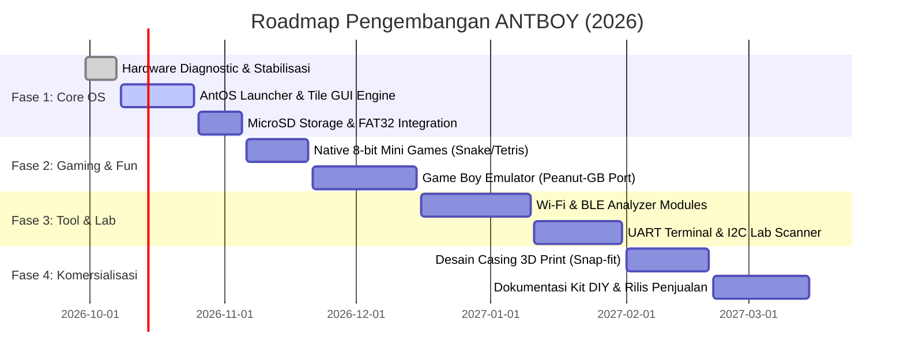

# PRODUCT REQUIREMENT DOCUMENT (PRD)
## ANTBOY (2026) — Multi-Purpose Cyber-Gaming Handheld Device

---

| Dokumen | Nilai |
|---|---|
| **Nama Proyek** | **ANTBOY (2026) Multi-Purpose Handheld Ecosystem** |
| **Versi Dokumen** | **1.1 (Comprehensive Engineering & Commercial Specification)** |
| **Tanggal Pembaruan** | September 2026 |
| **Status** | Active / Bring-Up Complete / Firmware Development |
| **Lead Developer & Hardware Designer** | Anton Prafanto |
| **Target Rilis MVP** | Q4 2026 |
| **Lisensi Hardware** | Proprietary (Hanya distribusi Gerber produksi, skematik/PCB source dilindungi) |
| **Lisensi Software** | Open-Core / MIT (Firmware Kernel, AntOS Launcher & Community Apps) |
| **Repository Resmi** | `https://github.com/antonprafanto/antboy.git` |

---

## 1. Executive Summary & Visi Produk

### 1.1 Latar Belakang & Masalah Pasar
Pasar konsol genggam retro DIY saat ini terpecah menjadi dua kategori ekstrem:
1. **Konsol Game Murni**: Hanya berfungsi untuk bermain game retro (misal: Arduboy, Odroid-Go), tanpa kemampuan konektivitas nirkabel atau kegunaan di dunia kerja nyata.
2. **Gadget Hacker/Hacker Tool**: Berfungsi untuk network/hardware security (misal: Flipper Zero, M5Stack Cardputer), namun tidak memiliki ergonomi controller game yang nyaman untuk hiburan harian.

### 1.2 Visi & Nilai Unik ANTBOY
**ANTBOY (2026)** menjembatani kedua dunia tersebut menjadi sebuah perangkat **EDC (Everyday Carry)** saku multifungsi:
> *"Bermain game retro klasik di saat santai, lalu beralih menjadi alat audit jaringan nirkabel, kontroler smart home, dan asisten lab elektronika saat bekerja."*

Perangkat ini dirancang dengan PCB 2-layer kustom (dimensi kompak 68.5 x 84.0 mm), ditenagai modul **ESP32 Dual-Core (Wi-Fi + BLE)**, layar tajam **2.0" IPS 320x240**, tata letak tombol ergonomis Game Boy (D-Pad analog ladder + A/B + 4 tombol fungsi), slot MicroSD, dan **Expansion Header GPIO 15-Pin** di sisi samping untuk modul modular (*backpack/cartridge*).

---

## 2. Target Pengguna & Persona

1. **Maker & Hardware Hacker**: Membutuhkan alat saku untuk membaca sinyal serial (UART), memindai sensor I2C, dan bereksperimen dengan protokol radio nirkabel tanpa harus membawa laptop.
2. **Mahasiswa / Pelajar Teknik Elektro & IT**: Menginginkan platform belajar mikrokontroler, FreeRTOS, dan pengembangan game embedded yang terjangkau, modular, dan menyenangkan.
3. **Retro Gaming Enthusiast**: Penggemar konsol portabel yang ingin memainkan game 8-bit klasik dan game homebrew buatan komunitas.
4. **Sysadmin & IoT Engineer**: Profesional yang memerlukan alat praktis untuk mengecek kanal Wi-Fi, menguji sinyal BLE, atau mengontrol perangkat MQTT smart home di lapangan.

---

## 3. Spesifikasi Hardware (Hardware Baseline V1)

### 3.1 Blok Diagram Arsitektur Hardware

```text
                 +---------------------------------------------------+
                 |           ANTBOY (2026) Hardware Core             |
                 +---------------------------------------------------+
                                           |
         +---------------------------------+---------------------------------+
         |                                 |                                 |
 [ Input Subsystem ]             [ Compute Subsystem ]             [ Output Subsystem ]
 - D-Pad (IO34, IO35)            - ESP32-WROOM-32 (240MHz)         - ST7789 IPS 320x240 (SPI)
 - Action: A (IO33), B (IO32)    - 520 KB SRAM / 4MB Flash         - Piezo Buzzer (IO26)
 - Func: SEL(27), STA(39)        - Wi-Fi 802.11 b/g/n              - Status LED Hijau (IO2)
 - Func: MEN(13), VOL(0)         - Bluetooth 4.2 BR/EDR+BLE        - MicroSD FAT32 (SPI, IO22)
 - Side Expansion 15-Pin (J4)    - Power Switch SPDT (SW0)         - Backlight PWM (IO14)
```

### 3.2 Tabel Pemetaan Pinout Komprehensif (Hardware V1)

| Periferal | Label Net | Pin ESP32 | Tipe I/O | Keterangan Rangkaian & Polarisasi |
|---|---|---|---|---|
| **Layar - SCK** | `/IO18` | GPIO 18 | Output | VSPI Bus Clock (Shared dengan MicroSD & J4 Pin 6) |
| **Layar - MOSI (SDA)**| `IO23` | GPIO 23 | Output | VSPI Bus Data (Shared dengan MicroSD & J4 Pin 10) |
| **Layar - CS** | `IO5` | GPIO 5 | Output | Active-LOW Chip Select ST7789 (Shared dengan J4 Pin 2) |
| **Layar - DC** | `IO21` | GPIO 21 | Output | Data/Command selector (Shared dengan J4 Pin 8) |
| **Layar - BLK** | `IO14` | GPIO 14 | Output | Backlight Control (HIGH = ON, PWM capable, Shared J4 Pin 4) |
| **Layar - RST** | `RST` | EN / CHIP_PU | Reset | **Hardwired ke Reset ESP32** (Bukan GPIO terpisah) |
| **MicroSD - CS** | `IO22` | GPIO 22 | Output | Active-LOW Chip Select SD Card (Shared J4 Pin 9) |
| **MicroSD - MISO** | `IO19` | GPIO 19 | Input | VSPI Data In / DAT0 (Shared J4 Pin 7) |
| **MicroSD - MOSI** | `IO23` | GPIO 23 | Output | VSPI Data Out / CMD (Shared ST7789) |
| **MicroSD - SCK** | `/IO18` | GPIO 18 | Output | VSPI Clock (Shared ST7789) |
| **MicroSD - DET** | `NC` | - | - | Card Detect pin tidak terhubung ke MCU (Polling mode) |
| **D-Pad Vertikal** | `IO35` | GPIO 35 (ADC1_CH7) | Input | UP = 4095 (3.3V), DOWN = ~2048 (Divider via R4 10k & R6 10k) |
| **D-Pad Horizontal**| `IO34` | GPIO 34 (ADC1_CH6) | Input | LEFT = 4095 (3.3V), RIGHT = ~2048 (Divider via R5 10k & R7 10k) |
| **Tombol A** | `IO33` | GPIO 33 | Input | Active-LOW ke GND, internal pull-up (Shared J4 Pin 15) |
| **Tombol B** | `IO32` | GPIO 32 | Input | Active-LOW ke GND, internal pull-up (Shared J4 Pin 14) |
| **Tombol SELECT** | `IO27` | GPIO 27 | Input | Active-LOW ke GND, internal pull-up (Shared J4 Pin 13) |
| **Tombol START** | `VN` / `IO39` | GPIO 39 (Sensor_VN) | Input | Active-LOW ke GND, pull-up eksternal R9 10k ke 3.3V |
| **Tombol MENU** | `IO13` | GPIO 13 | Input | Active-LOW ke GND, internal pull-up (Shared J4 Pin 3) |
| **Tombol VOL** | `IO0` | GPIO 0 | Input | Active-LOW ke GND, pull-up eksternal R3 10k ke 3.3V |
| **Audio Buzzer** | `IO26` | GPIO 26 | Output | Passive Piezo via R1 (1kΩ seri) ke J3. Resonansi 1.7–3.1 kHz |
| **Status LED** | `IO2` | GPIO 2 | Output | LED Hijau D1 via R10 (10kΩ seri) ke GND. HIGH = ON |
| **Power Switch** | `SW0` | - | Sakelar | SPDT Slide Switch pemutus jalur 3.3V antara regulator dan modul |

---

## 4. Analisis Ekspansi GPIO & Matriks Konflik Bus (J4 Header)

Header samping 15-pin (J4) dirancang untuk kartu ekspansi modular. Namun pengembang add-on **wajib** memahami matriks ketersediaan pin berikut:

```text
                       HEADER EKSPANSI 15-PIN (J4)
+------+--------+---------------------+------------------------------------------+
| Pin  | Net    | Status Internal     | Rekomendasi Penggunaan Add-on            |
+------+--------+---------------------+------------------------------------------+
| 1    | IO4    | BEBAS (Isolasi)     | GPIO Bebas / I2C SDA / Touch 0 / ADC2    |
| 2    | IO5    | SHARED: ST7789 CS   | JANGAN DIGUNAKAN saat LCD aktif          |
| 3    | IO13   | SHARED: Tombol MENU | Input Interrupt / Active-LOW Button      |
| 4    | IO14   | SHARED: Backlight   | JANGAN DIGUNAKAN (Khusus kontrol layar)  |
| 5    | IO16   | BEBAS (Isolasi)     | UART2 RX2 / I2C SCL / 1-Wire / NeoPixel  |
| 6    | IO18   | SHARED: SPI SCK     | SPI Bus Clock untuk Add-on Shield        |
| 7    | IO19   | SHARED: SD MISO     | SPI Bus MISO untuk Add-on Shield         |
| 8    | IO21   | SHARED: ST7789 DC   | JANGAN DIGUNAKAN saat render grafis      |
| 9    | IO22   | SHARED: SD Card CS  | JANGAN DIGUNAKAN untuk I2C (Gunakan CS)  |
| 10   | IO23   | SHARED: SPI MOSI    | SPI Bus MOSI untuk Add-on Shield         |
| 11   | IO25   | BEBAS (Isolasi)     | DAC Channel 1 / Analog Out / Servo PWM   |
| 12   | IO26   | SHARED: Buzzer J3   | Output Audio / PFM Tone                  |
| 13   | IO27   | SHARED: Tombol SEL  | Input Interrupt Eksternal                |
| 14   | IO32   | SHARED: Tombol B    | Input Button Eksternal                   |
| 15   | IO33   | SHARED: Tombol A    | Input Button Eksternal                   |
+------+--------+---------------------+------------------------------------------+
```

> [!IMPORTANT]
> **Pedoman Alokasi Pin Bebas (Zero Conflict)**:
> Modul Add-on baru sebaiknya memprioritaskan 3 pin yang 100% bebas:
> - **`IO4`** (Bebas)
> - **`IO16`** (Bebas)
> - **`IO25`** (Bebas, mendukung True 8-bit DAC)
> - Untuk bus **I2C Add-on**, gunakan konfigurasi: **SDA = `IO4`** dan **SCL = `IO16`** (JANGAN gunakan IO22 karena merupakan CS MicroSD).

---

## 5. Hardware Errata & Catatan Revisi (HW V1 vs HW V1.1)

Melalui uji bring-up hardware langsung pada board fisik, ditemukan beberapa catatan hardware yang terdokumentasi resmi:

### [HW-ERR-01] Resistor Seri Buzzer 1kΩ (Low Acoustic Volume)
- **Kondisi**: Resistor R1 terpasang 1kΩ antara GPIO 26 dan Buzzer J3 (impedansi ~16–32Ω). Mengakibatkan drop tegangan 97% di resistor, sehingga buzzer bersuara lirih.
- **Solusi Firmware V1**: Gunakan modulasi frekuensi pada titik resonansi akustik fisik buzzer (1,700 Hz s.d. 3,100 Hz) untuk efisiensi transfer energi maksimum.
- **Rencana Revisi HW V1.1**: Ganti R1 dengan nilai 33Ω–100Ω, atau tambahkan transistor NPN buffer (S8050 / 2N2222) dengan dioda flyback untuk volume maksimal.

### [HW-ERR-02] Ketiadaan Divider Tegangan ADC Pemantau Baterai
- **Kondisi**: Carrier PCB V1 tidak memiliki sirkuit pembagi tegangan (voltage divider) dari jalur baterai/5V ke pin ADC ESP32.
- **Solusi Firmware V1**: Tampilan persentase baterai di UI disimulasikan atau dinonaktifkan sementara saat berjalan pada board V1 tanpa modul tambahan.
- **Rencana Revisi HW V1.1**: Menambahkan sirkuit resistor divider 100kΩ / 100kΩ dari V_BAT ke pin `IO36` (VP/A0) yang saat ini tidak terpakai (Pad 4 U1 unconnected).

### [HW-ERR-03] Ketiadaan Pin Power (3.3V/5V dan GND) pada Header J4
- **Kondisi**: Header samping 15-pin (J4) seluruhnya mengalirkan sinyal GPIO, tanpa ada pin pinout daya (+3.3V/GND) khusus pada baris 15-pin tersebut.
- **Solusi DIY V1**: Modul shield mengambil kabel jumper daya (+3.3V dan GND) langsung dari pin socket modul Wemos D1 Mini32.
- **Rencana Revisi HW V1.1**: Mengubah form-factor header ekspansi menjadi 2x8 pin (16-pin) atau 1x16 pin yang menyertakan pin VCC 3.3V, 5V, dan GND.

---

## 6. Spesifikasi Mekanikal & Casing Enclosure

```text
                        DIMENSI FISIK PCB ANTBOY V1
       |<----------------------- 68.50 mm ----------------------->|
   --- +----------------------------------------------------------+
    ^  |  [SW0: Power]               [J1: ST7789 IPS 2.0" Display]|
    |  |                                                          |
    |  |  [SW1: MENU]                 [SW2: VOL]                  |
    |  |                                                          |
 84.00 |  [D-PAD]                                    [ACTION]     |
   mm  |    [UP]                                       [A]        |
    |  | [LEFT] [RIGHT]                             [B]           |
    |  |   [DOWN]                                                 |
    |  |                                                          |
    v  |  [SW3: SELECT]               [SW4: START]                |
   --- +----------------------------------------------------------+
       * Catatan Mekanikal: Mounting Holes = 0 (Tanpa lubang sekrup PCB)
```

1. **Dimensi PCB**: Tepat **68.50 mm (Lebar) x 84.00 mm (Tinggi)** dengan ketebalan standar 1.6 mm.
2. **Pedoman Desain Casing 3D Print**:
   - Karena PCB **tidak memiliki lubang baut (0 mounting holes)**, casing harus menggunakan mekanisme **Snap-Fit**, **Perimeter Rim Groove (Alur penahan bibir PCB)**, atau **Sandwich Clamping (Penjepit depan & belakang)**.
   - Jarak clearance tepi PCB ke dinding casing: **0.4 mm – 0.6 mm**.
   - Ketinggian tombol tact switch: 6x6x5 mm (diperlukan dudukan plunger tombol 3D print dengan toleransi 0.3 mm).

---

## 7. Arsitektur Software: "AntOS"

Sistem operasi modular berbasis **FreeRTOS** dengan arsitektur dua inti (*Dual-Core Task Separation*).

```text
+-------------------------------------------------------------------+
|                           AntOS LAUNCHER                          |
|             (Carousel Menu, Quick Settings, Status Bar)           |
+-------------------+-------------------+-------------------+-------+
|  PILAR 1: GAMING  | PILAR 2: WIRELESS |  PILAR 3: IoT     | PILAR 4: LAB   |
| - Game Boy Emu    | - Wi-Fi Analyzer  | - ESP-NOW Chat    | - UART Monitor |
| - Native Games    | - BLE Scanner     | - MQTT Dashboard  | - I2C Scanner  |
| - Chiptune Audio  | - BLE Gamepad HID | - Clock & Weather | - Signal Gen   |
+-------------------+-------------------+-------------------+----------------+
|                        AntOS CORE SERVICES                         |
|  Power Manager | File System (FAT32) | Audio Engine | Display HAL & DMA    |
+--------------------------------------------------------------------+
|                         FreeRTOS KERNEL                            |
|        Core 0: Network & Background   |   Core 1: UI Engine & Input        |
+--------------------------------------------------------------------+
```

### 7.1 Protokol Arbitrasi SPI Bus (ST7789 vs MicroSD)
Karena layar LCD dan kartu MicroSD berbagi jalur clock (`IO18`) dan data MOSI (`IO23`), kernel AntOS memberlakukan aturan arbitrasi:
1. **Mutex Mutlak**: Setiap akses file IO di MicroSD wajib mengunci `spi_bus_mutex`.
2. **Chip Select Isolation**:
   - Saat MicroSD aktif (`IO22` LOW), pin LCD CS (`IO5`) dipaksa HIGH.
   - Saat Layar me-render frame buffer via DMA, pin SD CS (`IO22`) dipaksa HIGH.
3. **Kecepatan Bus**:
   - Mode Rendering Layar: 40 MHz SPI (Mode 3).
   - Mode Akses MicroSD: 20–25 MHz SPI (Mode 0). Frekuensi disesuaikan otomatis sebelum transaksi dimulai.

### 7.2 Power Management & Deep Sleep
- **Wakeup Vector**: Tombol `MENU` (`IO13` / RTC_GPIO14) atau `START` (`IO39` / RTC_GPIO3) dikonfigurasi sebagai sumber *wake-up interrupt* eksternal via `esp_sleep_enable_ext0_wakeup()`.
- **Konsumsi Arus Operasional**:
  - Gaming Aktif (Layar ON + Buzzer): ~110–140 mA.
  - Mode Wireless Aktif (Wi-Fi Promiscuous Scan): ~170–210 mA.
  - Deep Sleep (MCU ESP32 saja): ~15 µA. (Catatan: Total konsumsi board carrier + devboard sekitar 8–12 mA akibat LDO & chip USB-UART devboard).

---

## 8. Rincian Kebutuhan Fungsional (4 Pilar Fitur)

### PILAR 1: Retro Gaming & Entertainment Engine

| ID | Fitur | Deskripsi | Kebutuhan Teknis | Prioritas |
|---|---|---|---|---|
| **GAME-01** | **Game Boy Emulator (GB/GBC)** | Menjalankan ROM Game Boy asli dari MicroSD. | Porting Peanut-GB, Frame-skipping 60FPS, palet warna dinamis. | 🔴 High |
| **GAME-02** | **Native Mini-Games** | Game bawaan tanpa kartu SD: Snake, Tetris, Pong, Space Invaders. | Engine sprite 2D ringan, persistent high score di NVS Flash. | 🔴 High |
| **GAME-03** | **Chiptune Audio Player** | Pemutar lagu 8-bit retro (file format `.mid`, `.vgm`, `.mod`). | RTTTL / Chiptune sequence parser, visualisator spektrum audio real-time. | 🟡 Medium |
| **GAME-04** | **Save State Manager** | Menyimpan progres emulator langsung ke MicroSD. | Dump memory RAM emulator ke file `.sav` di MicroSD FAT32. | 🟡 Medium |

### PILAR 2: Wireless & Cyber-Tool (The Pocket Swiss-Army Knife)

| ID | Fitur | Deskripsi | Kebutuhan Teknis | Prioritas |
|---|---|---|---|---|
| **WIFI-01** | **Wi-Fi Spectrum & RSSI Analyzer** | Memindai SSID 2.4GHz sekitar, mengukur kuat sinyal dalam grafik waterfall. | Wi-Fi Promiscuous mode, visualisasi waterfall 320x240, deteksi kanal padat. | 🔴 High |
| **WIFI-02** | **Packet Monitor & AP Tracker** | Mendeteksi keberadaan access point asing dan lalu lintas paket beacon. | Packet sniffer non-intrusif, export log ke MicroSD. | 🟡 Medium |
| **BLE-01** | **BLE Beacon Scanner** | Mendeteksi perangkat Bluetooth di sekitar (TWS, smartwatch, tracker). | ESP32 BLE GAP Scanner, estimasi jarak via kalkulasi log-distance RSSI. | 🔴 High |
| **HID-01** | **Bluetooth Virtual Gamepad** | ANTBOY bertindak sebagai controller nirkabel Bluetooth untuk PC/Android. | BLE HID Gamepad profile, latency < 12 ms, mapping D-Pad & tombol fisik. | 🟠 High |
| **HID-02** | **Wireless Presentation Clicker** | Tombol A/B dan D-Pad digunakan untuk memindah slide presentasi. | BLE Keyboard profile (tombol PgUp, PgDn, F5, Esc). | 🟢 Low |

### PILAR 3: IoT & Smart Home Pocket Controller

| ID | Fitur | Deskripsi | Kebutuhan Teknis | Prioritas |
|---|---|---|---|---|
| **IOT-01** | **ESP-NOW Off-Grid Walkie-Talkie** | Komunikasi pesan teks instan antar ANTBOY tanpa internet hingga radius 150m. | ESP-NOW Broadcast/Unicast protocol, keyboard virtual on-screen di layar. | 🟠 High |
| **IOT-02** | **Smart Home MQTT Dashboard** | Sakelar remote untuk menyalakan perangkat Home Assistant / broker MQTT. | Klien MQTT ringan via Wi-Fi lokal, widget tile status ON/OFF. | 🟡 Medium |
| **IOT-03** | **Desk Clock & Weather Display** | Jam meja digital dengan sinkronisasi waktu NTP internet dan cuaca lokal. | NTP Client, OpenWeatherMap API fetcher, auto-dimming layar saat idle. | 🟢 Low |

### PILAR 4: Hardware Hacker & Lab Companion (Pemanfaatan Header J4)

| ID | Fitur | Deskripsi | Kebutuhan Teknis | Prioritas |
|---|---|---|---|---|
| **LAB-01** | **Portable UART Serial Monitor** | Menampilkan log serial `Serial.print()` dari board eksternal ke layar. | Pin `IO16` (RX), baud rate selector (9600 s.d. 115200), auto-scroll terminal view. | 🔴 High |
| **LAB-02** | **I2C Bus Scanner & Visualizer** | Memindai alamat sensor I2C yang terhubung ke header dan membaca datanya. | I2C Master pada `IO4` (SDA) & `IO16` (SCL) **bebas konflik**, auto-detect sensor. | 🟠 High |
| **LAB-03** | **PWM & Frequency Signal Generator** | Menghasilkan sinyal PWM untuk pengujian motor servo atau dimmer LED. | ESP32 LEDC PWM generator pada pin `IO25` atau `IO4`, slider duty cycle via D-Pad. | 🟡 Medium |
| **LAB-04** | **Mini Logic Probe** | Membaca status logika (HIGH, LOW, FREQ) pada sirkuit eksternal. | Digital input polling / interrupt counter pada pin `IO4`, visualisasi status. | 🟡 Medium |

---

## 9. Bill of Materials (BOM) — Daftar Komponen Produksi

Daftar komponen resmi untuk perakitan kit komersial (Tier 1 & Tier 2):

| No | Referensi | Deskripsi Komponen | Package / Footprint | Jumlah | Catatan Sumber / Fungsi |
|---|---|---|---|---|---|
| 1 | **U1** | Modul ESP32 Wemos D1 Mini32 | DevBoard Pin Socket (2x20) | 1 | Unit komputasi utama |
| 2 | **J1** | 2.0" IPS TFT Display (ST7789) | 1x09 Pin Header 2.54mm | 1 | GMT020-03-SD (320x240 IPS) |
| 3 | **J2** | MicroSD Card Push-Pull Socket | SMD micro_socket_A | 1 | Slot media penyimpanan |
| 4 | **J3** | Passive Piezo Buzzer Transducer | Conn_01x02 PTH 2.54mm | 1 | Output audio akustik |
| 5 | **J4** | Header Ekspansi Samping 15-Pin | 1x15 Pin Header 2.54mm | 1 | Konektor modular add-on |
| 6 | **D1** | Green Status LED | 1206 SMD | 1 | Indikator status GPIO 2 |
| 7 | **C2** | 100nF (0.1µF) Ceramic Capacitor | 0805 SMD | 1 | Decoupling tegangan 3.3V |
| 8 | **R1** | 1kΩ Resistor (Buzzer Attenuator)| 1206 SMD | 1 | Pembatas arus piezo buzzer |
| 9 | **R3** | 10kΩ Resistor (VOL Pull-up) | 1206 SMD | 1 | Pull-up GPIO 0 ke 3.3V |
| 10| **R4** | 10kΩ Resistor (D-Pad Vertikal) | 1206 SMD | 1 | Resistor ladder DOWN (IO35) |
| 11| **R5** | 10kΩ Resistor (D-Pad Horisontal)| 1206 SMD | 1 | Resistor ladder RIGHT (IO34) |
| 12| **R6** | 10kΩ Resistor (D-Pad Vertikal) | 1206 SMD | 1 | Resistor ladder pull-down (IO35) |
| 13| **R7** | 10kΩ Resistor (D-Pad Horisontal)| 1206 SMD | 1 | Resistor ladder pull-down (IO34) |
| 14| **R9** | 10kΩ Resistor (START Pull-up) | 1206 SMD | 1 | Pull-up GPIO 39 ke 3.3V |
| 15| **R10**| 10kΩ Resistor (LED Limiter) | 1206 SMD | 1 | Pembatas arus LED D1 |
| 16| **SW0**| Sakelar On/Off Geser (SPDT) | PinSocket 1x03 PTH 2.54mm | 1 | Sakelar daya utama |
| 17| **SW1–10**| Tactile Push Button Switch | SW_PUSH_6mm PTH | 10 | MENU, VOL, SEL, STA, A, B, D-Pad |

---

## 10. Roadmap Pengembangan & Rilis



---

## 11. Model Komersialisasi Produk

| Paket Penjualan | Target Pasar | Isi Paket Penjualan |
|---|---|---|
| **Tier 1: Bare PCB Only** | DIY Maker & Solder Enthusiast | Papan PCB ANTBOY produksi pabrik + file panduan perakitan digital & BOM lengkap. |
| **Tier 2: Complete DIY Kit** | Mahasiswa / Hobbyist yang ingin belajar solder | Papan PCB + Modul ESP32 + LCD ST7789 + seluruh komponen SMD 1206/0805 dan PTH siap rakit. |
| **Tier 3: Ready-to-Play Edition** | Kolektor & Pengguna Langsung | Perangkat sudah dirakit & diuji penuh (*factory tested*), terpasang casing 3D print akrilik/PLA, dan MicroSD terisi game/tools. |
| **Tier 4: Modular Add-ons** | Pengguna yang ingin upgrade fungsi | Shield ekspansi terpisah (RF Cyber Pack, Sensor Pack, LoRa Pack). |

---

*Dokumen ini merupakan panduan spesifikasi teknis dan komersialisasi resmi ANTBOY (2026). Dilarang menyebarkan skematik mentah atau file desain PCB KiCad tanpa izin pemilik hak cipta.*
